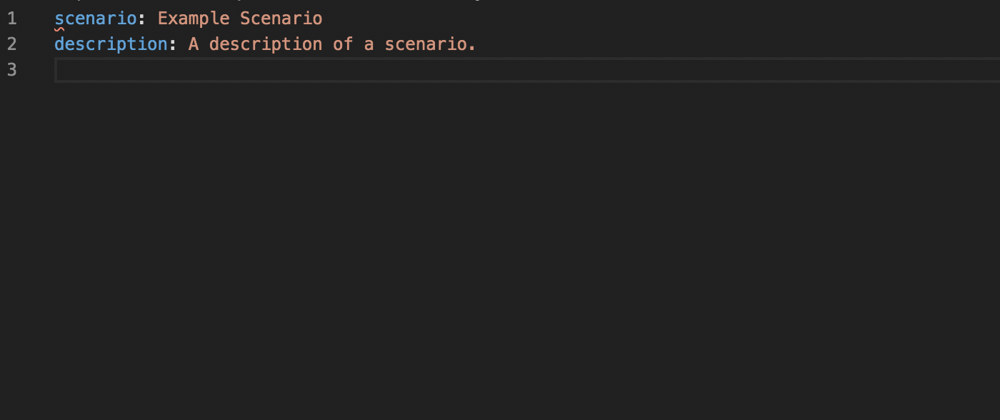
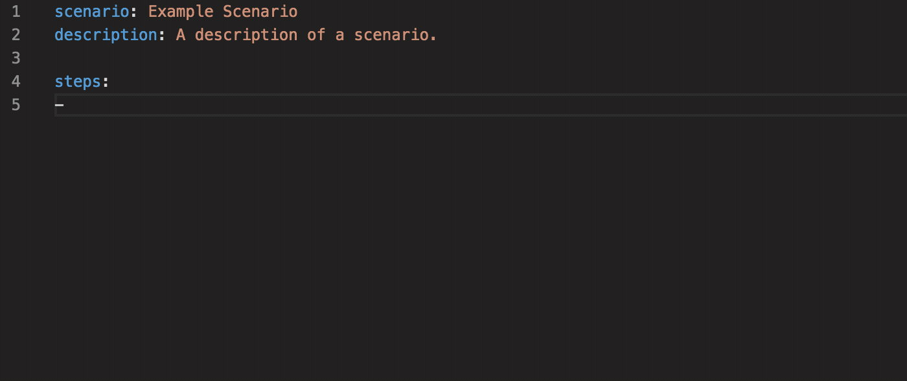
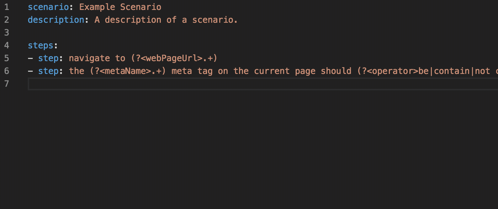
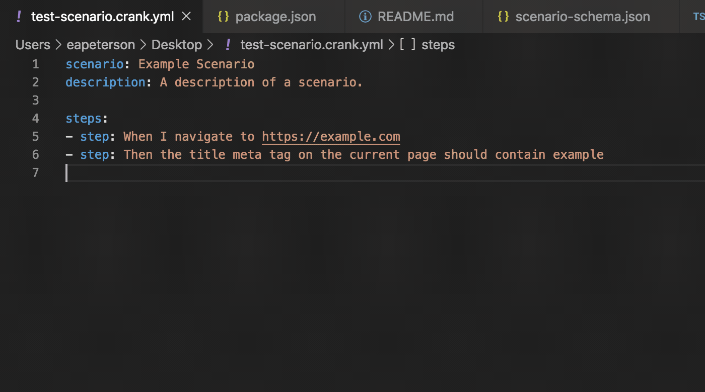

# Crank Scenario Language

[Crank](https://crank.run?utm_source=vscode) is a BDD test automation framework
for validating workflows, applications, data, and experiences that are at least
partially defined, configured, and built in SaaS platforms.

This is a Visual Studio Code extension that makes it easier to author and run
Crank test scenarios using VS Code.

## Features

The following features are keyed on the name of a given file ending in
`.crank.yml`.

#### Scenario Format Hints

#### Step IntelliSense

#### Data IntelliSense

#### Run Scenarios from File Context Menu

## Requirements

This extension will not be useful to you unless you've already installed the
Crank CLI locally and installed the Cogs needed for your tests. Find out how
below:

- [Install Crank](https://crank.run/intro/install)
- [Find and Install Cogs](https://crank.run/discover-cogs)
- [Getting Started](https://crank.run/intro#writing-your-first-scenario)

## Release Notes

See the [CHANGELOG.md](CHANGELOG.md) for release notes.
